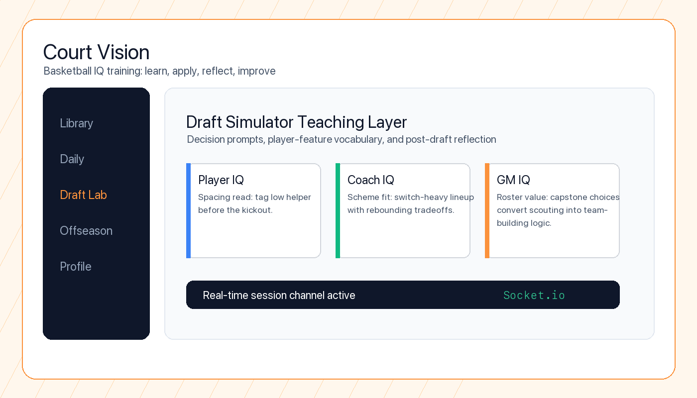

# Court Vision

Court Vision is a free, web-first basketball IQ training platform that helps users learn to read the game through three lenses:

- **Player IQ**: on-court reads, spacing, decision-making
- **Coach IQ**: scheme fit, lineup logic, adjustment timing
- **GM IQ**: roster building, valuation, draft/offseason process

The product blends structured lessons, daily challenges, and simulation-based capstones (draft + offseason) into a single learning loop: **learn -> apply -> reflect -> improve**.



## Why This Matters

### Problem

Most basketball products optimize for entertainment, hot takes, or fantasy outcomes. They rarely teach the process behind spacing reads, lineup tradeoffs, scouting uncertainty, or cap/roster decisions.

### Who It Helps

Court Vision is for fans, players, students, and early-career analysts who want to understand why basketball decisions are good or bad, not just whether the final result worked.

### What I Built

I built a TypeScript monorepo for a basketball IQ learning platform with lessons, daily challenges, progress tracking, an admin CMS, draft simulation, and offseason simulation. The product teaches Player IQ, Coach IQ, and GM IQ through a loop of short instruction, applied decisions, and post-decision reflection.

### Technical Decisions

- React, Vite, TypeScript, and Tailwind power the web client.
- Express and Socket.io support API-backed and real-time learning/simulation flows.
- A shared package keeps client/server contracts and reusable schemas aligned.
- The app stays guest-first and local-first where possible, with Supabase-backed paths available when configured.
- The same player-feature vocabulary is reused across lessons, draft decisions, and offseason team-building surfaces.

### How To Run It

```bash
pnpm install
pnpm dev
pnpm build
pnpm test
```

### What I Would Improve Next

The next work is deeper visual consistency across library, track, profile, draft, and offseason screens, plus live Supabase verification for account upgrade and second-device continuity.

## Monorepo Structure

- `client` - React 18 + TypeScript frontend
- `server` - Node.js + Express 4 + Socket.io 4 backend
- `shared` - Shared TypeScript contracts and schemas used by both apps
- `.planning` - project strategy, roadmap, requirements, and execution artifacts

## Core Product Areas

- **Learning platform**: lesson catalog across Player/Coach/GM IQ, onboarding, progress tracking, recaps, discussion
- **Engagement loop**: daily challenges, streaks, badges, share cards, friend completion board
- **Simulation capstones**:
  - Draft Simulator teaching overlays + post-draft analysis
  - Offseason Simulator decision loop (team context through recap)
- **Admin CMS**: author, tag, publish lessons and schedule daily challenges

## Architecture Snapshot

- **Frontend**: React 18, Vite, TypeScript, Tailwind CSS
- **Backend**: Express APIs + Socket.io real-time flows
- **Shared contracts**: `shared/` package for cross-app types/schemas
- **Persistence model**: local-first and guest-first, with Supabase-backed paths where configured
- **Data approach**: seeded NBA identity/stat pipelines and shared player-feature vocabulary across teaching + sim experiences

## Getting Started

This repo is pnpm-only. Workspace membership is declared in `pnpm-workspace.yaml`, and `pnpm-lock.yaml` is the committed lockfile.

### 1) Install dependencies

```bash
pnpm install
```

### 2) Run local development

```bash
pnpm dev
```

### 3) Build for production

```bash
pnpm build
```

### 4) Start server (after build)

```bash
pnpm start
```

## Scripts

Run these from the repository root:

- `pnpm dev` - start the client and API server together
- `pnpm build` - build `shared`, then `client`, then `server`
- `pnpm start` - start server workspace
- `pnpm lint` - lint client and server
- `pnpm typecheck` - strict TypeScript checks across workspaces
- `pnpm test` - run shared and server tests once in non-interactive mode
- `pnpm smoke` - run Playwright smoke tests
- `pnpm audit:dead-code` - run Knip dead-code scan

## Quality Gate (Before Shipping)

Expected baseline before claiming a task complete:

1. `pnpm lint`
2. `pnpm typecheck`
3. `pnpm audit:dead-code`
4. `pnpm test`
5. Update `.tracker/PROJECT_TRUTH.md` with current state

## Planning and Product Source of Truth

Primary planning and execution documents live in `.planning/`:

- `PROJECT.md` - product vision, constraints, decisions
- `ROADMAP.md` - phased delivery and current implementation status
- `REQUIREMENTS.md` - requirement IDs and traceability
- `phases/` - per-phase plans, summaries, verification artifacts
- `research/` and `codebase/` - discovery artifacts and technical mapping

## Current Status

Roadmap implementation is in an advanced state:

- Phase 1-3 complete (foundation, infra/auth, baseline data layer)
- Phase 4-8 implemented (lessons/CMS, onboarding/discovery, daily engagement, draft teaching layer, profile/account upgrade)
- Phase 9-10 implemented (offseason simulator foundation + decision loop), with final human verification gates still tracked
- Additional in-flight data/model calibration work exists beyond the original Phase 3 close-out

See `.planning/ROADMAP.md` for the live phase-by-phase status and release gates.

## Key Product Principles

- **Offline/local-first behavior**: app should still run when Supabase is not configured
- **Guest-first entry**: users can start without creating an account
- **Shared contracts**: cross-app types belong in `shared/`, not duplicated
- **Single stat vocabulary**: teaching, draft, and offseason features should stay aligned to the same player-feature mapping

## Contributing Notes

- Read `.planning/PROJECT.md`, `.planning/ROADMAP.md`, and `.planning/REQUIREMENTS.md` before architecture-level changes
- Prefer incremental changes over broad rewrites
- Keep `main` deployable
- Avoid introducing duplicated client/server types when a shared contract is appropriate

## Assurance and Certification

The repository-owned assurance contract is at .pronto/behavior-assurance.json. It describes the guest-first learning-loop behavior and the edge cases that must remain covered.

The required evidence gates are declared in .quality-runner.toml and are mirrored by these commands:

- pnpm format
- pnpm lint
- pnpm typecheck
- pnpm test
- pnpm build
- pnpm smoke
- pnpm audit:dead-code
- pnpm secret:scan
- pnpm dependency:security

Run the full set before requesting certification evidence. Certification setup is distinct from a 4/4 maturity result; both the maturity evidence and the assurance gates must remain current.

## License

No license has been declared in this repository yet.
